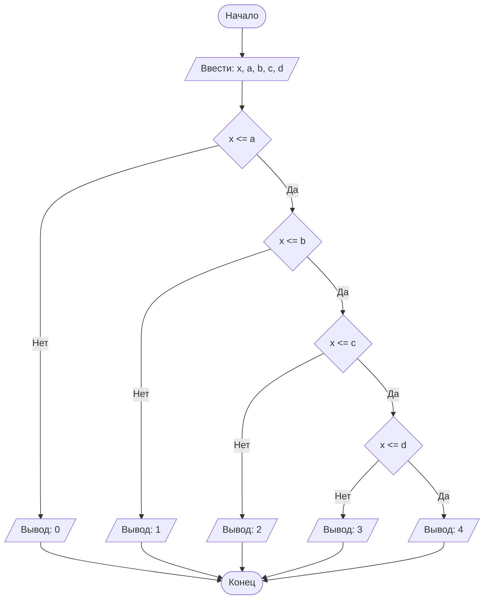

## Отчет по лабораторной работе № 1

#### № группы: `ПМ-2402`

#### Выполнил: `Белова Полина Сергеевна`

#### Вариант: `3`

### Cодержание:

- [Постановка задачи](#1-постановка-задачи)
- [Входные и выходные данные](#2-входные-и-выходные-данные)
- [Выбор структуры данных](#3-выбор-структуры-данных)
- [Алгоритм](#4-алгоритм)
- [Программа](#5-программа)
- [Анализ правильности решения](#6-анализ-правильности-решения)

### 1. Постановка задачи

#Условие задачи 

> На вход подаётся 5 натуральных чисел X, A, B, C, D. Шарик диаметром X пытаются протащить через последовательность отверстий диаметрами A, B, C, D. Необходимо определить, через какое количество отверстий удастся протащить шарик.

- Необходимо последовательно сравнить диаметр шара X с диаметрами отверстий. Сначала с A, затем с B, после с C и в конце концов с D.Если диаметр шара слишком большой для отверстия диаметром A и не может через него пройти, то шар не сможет пройти и через остальные отверстия диаметрами B, C и D. Такие же ситуации стоит рассмотреть

### 2. Входные и выходные данные

#### Данные на вход

На вход программа должна получать 5 чисел, принадлежащих множеству натуральных чисел N. Так как верхняя и нижняя границы получаемых нам в условии не даны, мы сами их установим.Так, нижняя граница будет равна 1, так как 0 не натуральное число, а верхняя граница будет равна
чисел.

|             | Тип                | min значение    | max значение   |
|-------------|--------------------|-----------------|----------------|
| X (Число 1) | Целое число        | 1               | 10<sup>9</sup> |
| A (Число 2) | Целое число        | 1               | 10<sup>9</sup> |
| B (Число 3) | Целое число        | 1               | 10<sup>9</sup> |
| C (Число 4) | Целое число        | 1               | 10<sup>9</sup> |
| D (Число 5) | Целое число        | 1               | 10<sup>9</sup> |


#### Данные на выход

Т.к. программа должна вывести количество отверстий, через которых пройдет шар, то на выход мы получим
единственное неотрицательное целое число, не превышающее 4 (число равно 4, потому что всего отверстий было подано 4).

|         | Тип                                | min значение | max значение   |
|---------|------------------------------------|--------------|----------------|
| Число 1 | Целое неотрицательное число        | 0            | 4              |

### 3. Выбор структуры данных

Программа получает 5 целых неотрицательных числа, не превышающих 10<sup>9</sup> < 2<sup>30</sup>. Поэтому для их хранения
можно выделить 5 переменных (`x`, `a`, `b`, `c` `d`) типа `int`.

|             | название переменной | Тип (в Java) | 
|-------------|---------------------|--------------|
| X (Число 1) | `x`                 | `int`        |
| A (Число 2) | `a`                 | `int`        | 
| B (Число 2) | `b`                 | `int`        |
| C (Число 2) | `c`                 | `int`        |
| D (Число 2) | `d`                 | `int`        |

### 4. Алгоритм

#### Алгоритм выполнения программы:

1. **Ввод данных:**  
   Программа считывает 5 целых числа, обозначенные как `x`, `a`, `b`, `c`, `d`.

2. **Сравнение чисел:**  
   1. Программа сравнивает значения `x` и `a`. Если `x` меньше или равно `a`, программа переходит к следующему шагу для
   работы с `x`. Если `x` больше, программа выполняет действия вывода ответа на экран.
   2. Программа сравнивает значения `x` и `b`. Если `x` меньше или равно `b`, программа переходит к следующему шагу для
   работы с `x`. Если `x` больше, программа выполняет действия вывода ответа на экран.
   3. Программа сравнивает значения `x` и `c`. Если `x` меньше или равно `c`, программа переходит к следующему шагу для
   работы с `x`. Если `x` больше, программа выполняет действия вывода ответа на экран.
   4. Программа сравнивает значения `x` и `d`. Если `x` меньше или равно `d`, программа переходит к следующему шагу для
   работы с `x`. Если `x` больше, программа выполняет действия вывода ответа на экран.

3. **Проверка знака для выбранного числа:**
    - Если было выбрано число `x` (так как оно больше или равно `y`), проверяется, положительное оно или отрицательное.
      Если `x` положительное, оно выводится на экран. Если отрицательное, выводится его модуль (т.е. противоположное
      по знаку значение).
    - Если было выбрано число `y` (поскольку оно больше `x`), выполняется аналогичная проверка. Если `y` положительное,
      оно выводится на экран. Если отрицательное, выводится его модуль.

4. **Вывод результата:**  
   Вывод происходит в процессе выполнения программы

#### Блок-схема



### 5. Программа

```java
import java.io.PrintStream;
import java.util.Scanner;
public class Main {
    // Объявляем объект класса PrintStream для вывода данных
    public static PrintStream out = System.out;
    // Объявляем объект класса Scanner для ввода данных
    public static Scanner in = new Scanner(System.in);
    public static void main(String[] args){
        // Считывание пяти целых чисел x, a, b, c, d из консоли
        out.println("Введите диаметр шарика: ");
        int x = in.nextInt();
        out.println("Введите диаметры отверстий: ");
        int a = in.nextInt();
        int b = in.nextInt();
        int c = in.nextInt();
        int d = in.nextInt();
        out.println("Шарик может пройти через ");
        // определение через сколько отверстий пройдет шар
        // если диаметр шара меньше или равен диаметру отверстия, мы переходим к следующему отверстию
        // если диаметр шара больше диаметра отверстия, мы выводим, через сколько отверстий успел пройти шар
        if (x <= a) {
            if (x <= b) {
                if (x <= c) {
                    if (x <= d)
                        out.print(4 + " отверстия");
                    else
                        out.print(3 + " отверстия");
                }
                else
                    out.print(2 + " отверстия");
            }
            else
                out.print(1 + " отверстие");
        }
        else out.print(0 + " отверстий");

    }
}```

### 6. Анализ правильности решения

Программа работает корректно на всем множестве решений с учетом ограничений.

1. Тест на `X > Y > 0`:

    - **Input**:
        ```
        5 1.3
        ```

    - **Output**:
        ```
        5
        ```

2. Тест на `X < Y < 0`:

    - **Input**:
        ```
        -4 -2.2
        ```

    - **Output**:
        ```
        2.2
        ```

3. Тест на `X < 0 < Y`:

    - **Input**:
        ```
        -4 5
        ```

    - **Output**:
        ```
        5
        ```

4. Тест на `X = 0` или `Y = 0`:

    - **Input**:
        ```
        0 -3
        ```

    - **Output**:
        ```
        3
        ```

5. Тест на ограничение задачи:

    - **Input**:
        ```
        -1000000000 1000000000
        ```

    - **Output**:
        ```
        1000000000
        ```
